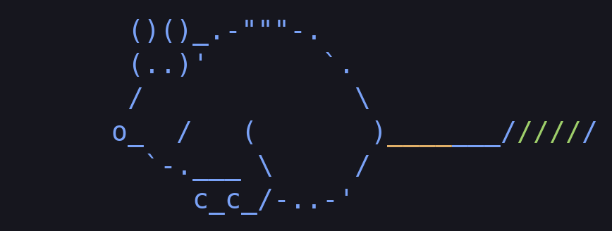

# YunusPi

  

A customized Pi coding-agent harness with bounded subagents, free/cheap model routing, lazy skills, contextual guidance, code-quality tools, extractive context utilities and durable runtime patches.

Bring your own provider credentials. This repository contains reusable code and clean examples, not the author's accounts, sessions, memories, provider state or deployment details.

## Install

Start with [installation](docs/INSTALL.md) and [platform support](docs/PLATFORMS.md). The full harness targets Linux; use WSL2 on Windows or a Linux VM on macOS for the same environment. Native macOS limitations are documented. No native Windows compatibility is claimed.

Inspect the installer before applying it. It must not overwrite an existing installation without explicit backup authorization. Provider configuration examples are in `config/`; replace credentials locally through provider login or environment variables. Never commit your populated configuration.

## What is included

- Main-agent and subagent workflows, bounded parallel/fusion execution and failure recovery.
- [Dynamic action plans](docs/ACTION-PLANS.md) with hierarchy, dependencies, execution modes, verification evidence, compact context and automatic peer file scopes.
- [Disposable sandboxes](docs/SANDBOXES.md) for quick isolated experiments, with copied fixtures, no network, resource limits and automatic cleanup.
- Capability-aware provider discovery, economical routing and provider-specific cache accounting.
- Remembers the last model selected in the main interactive session for future launches; child and headless runs do not overwrite it. Explicit launch options and project configuration retain their normal precedence.
- On-demand skills including programming, research, ML, office documents, Blender, CAD and terminal video/audio processing.
- [Skill routing and batch source checks](docs/SKILLS-AND-CHECKS.md): broader catalog matching, scoped pre-edit skill review, component anti-boilerplate checks and compact syntax diagnostics across languages and configuration formats.
- Evidence checks, diagnostics, snapshots, context slicing, output distillation and source-backed handoffs.
- Persistent project intelligence with automatic discovery, concurrent session contributions, bounded architecture retrieval and a live `/graph` window; see [project intelligence](docs/PROJECT-INTELLIGENCE.md).
- Autonomous web search with bounded fallback, plus session activity counters and a `/metrics` panel for tools, agents, skills, hooks and cache usage; see [search and session metrics](docs/SESSION-METRICS.md).
- [Long browser and community workflows](docs/ISOLATION-AND-WEB.md): niche-site discovery, renewable isolated browser sessions, form controls, draft checks and saved submission/reconciliation guidance for authorized questions, answers and marketing.
- Local media tools for video frames, audio measurements, bounded editing and editable MIDI/WAV sketches, with skills for motion graphics, video analysis, sound analysis and music composition. FFmpeg/ffprobe and browser-based rendering require the corresponding installed runtimes.
- Version-specific core patches and structural verification.
- Launch-scoped harness mutation protection and on-demand self-maintenance, browser, community promotion and organic-growth guidance; see [security boundaries](docs/SECURITY.md).

The optional mini preprocessing model is not bundled with a Python environment, weights or authentication. Its client falls back to raw data when unavailable. Model-specific tests and personal development artifacts are not distribution assets.

Read [session cost accounting](docs/COST-ACCOUNTING.md) for the footer estimate, `/cost` breakdown, provider pricing and coverage limits.

Read [model routing and automatic assistance](docs/MODEL-ROUTING.md) for task quality gates, cached benchmark research, free-model preference and autonomous subagent, swarm and fusion budgets.

## Privacy and updates

[Public release rules](docs/PUBLISHING.md) describe the export boundary, checks and update procedure. Run `node scripts/check-public.mjs` before every commit/push. CI scans tracked content and history as well. Hooks and CI reduce risk; they cannot prove that arbitrary prose contains no confidential information. Review each diff.

A private `/harness-backup` ZIP intentionally contains credentials for restoration. **Never publish it or a conversation export.** Public releases must come from the dedicated public exporter.

## Verification

`npm test` runs distribution safety and installer tests. Test files run serially so process-heavy fixtures do not contend with routing latency checks. Installed harness structural checks are separate from behavioral tests and live provider availability. The public package does not include private session fixtures or historical evaluation corpora. No test count or catalog entry guarantees every model's output quality.

## License

Custom code is MIT licensed. Vendored components retain their original licenses and notices; see [third-party notices](THIRD_PARTY_NOTICES.md). Model weights and external applications have their own terms and are not bundled.
