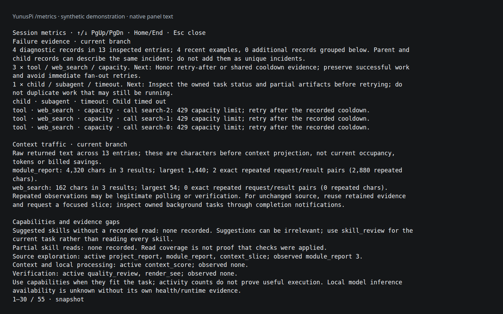
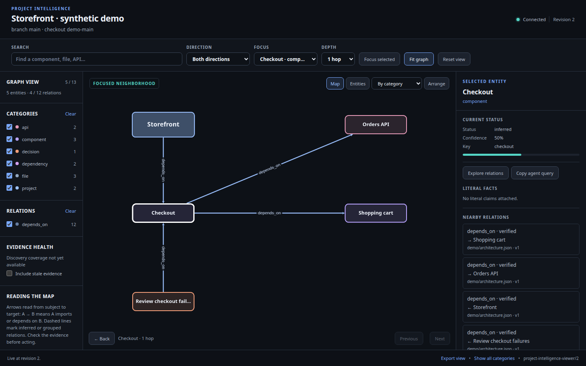

# YunusPi

<p align="center">
  
</p>

**An independently maintained coding agent and Pi-derived core, with tools, skills, project memory and a layered intelligence stack.**

YunusPi owns its core and provides code inspection, browser and media tools, project memory, subagents, quality checks and runtime fixes. You bring your own model provider and credentials. The agent starts with a core tool set and can discover specialized capabilities as the task develops.

The aim is practical: help the agent reuse what the harness already provides, spend less context on irrelevant instructions, and keep control over how it solves the task.

[Install](docs/INSTALL.md) · [Capability inventory](docs/CAPABILITIES.md) · [Platform support](docs/PLATFORMS.md) · [Tools, skills and reminders](docs/GUIDANCE-AND-DIAGNOSTICS.md) · [Model routing](docs/MODEL-ROUTING.md) · [Release/versioning](docs/PUBLISHING.md) · [Security](docs/SECURITY.md)

Pi 0.85.1 is the historical origin; YunusPi Core starts its own lineage at 0.1.0. Installation builds repository-owned source, and updates accept only explicitly selected YunusPi source. Use `yunuspi --core-info` to inspect the active identity. [Core ownership](docs/CORE-OWNERSHIP.md) · [Manual upstream ports](UPSTREAM-PORTING.md)

Version 0.5.1 repairs model discovery, formatting aliases and stale local-error exclusions. It includes the bounded periodic session observer configured through `/models`, async jobs, project intelligence and creative tools. [What changed](CHANGELOG.md) · [Session observer](docs/SESSION-OBSERVER.md) · [Async and creative tools](docs/ASYNC-AND-STUDIO.md)

## How a session works

Start `yunuspi` in your project directory, choose an available model, and describe the work normally. You do not need to select a workflow or browse a catalog before every task.

- **Start small.** Main sessions expose core editing, inspection, coordination and quality tools. Specialized tool schemas and the full skill catalog stay out of the initial model context.
- **Discover when useful.** The agent can browse capability groups, search short descriptions, and load selected tools or read a relevant skill. Direct search and activation are also available; browsing is optional.
- **Get gentle reminders.** Your first prompt includes a brief, once-per-session invitation to look over useful harness capabilities and then focus on the task. It shares the existing request, with no extra model call, and does not repeat on resume. Relevant checkpoints can offer a concrete optional tool or skill match; those suggestions are deduplicated, have cooldowns, and stop after successful discovery within that request.
- **Keep responsibility clear.** The agent chooses its approach. Safety hooks enforce access and mutation boundaries; quality checks track evidence. A suggestion, a tool call or agreement between subagents is not proof that the work is correct.

Enabled tools become available at the next model turn within the same request; discovery batches schema changes once after the current tool batch. Within an uninterrupted session, selected tools stay available. Resuming an old session restores a small recent tool set plus tools needed for unfinished calls, instead of carrying every historical discovery forward. Explicit tool selections and child-agent limits retain their authority.

Use `/reminder <text>` to give the agent a recurring instruction. The full text is sent immediately, then repeated every five minutes at the next active turn boundary. Reminders survive compaction and resume. `/reminder list` shows them; `/reminder clear` stops them. Periodic reminders do not restart completed work while the session is idle.

The footer keeps the harness counters to agents and failures, alongside current activity. Open `/metrics` for detailed tool, skill, hook and workflow counts.

### Discovery in practice

These are agent tool calls, not terminal commands:

```js
// Search short previews without loading full tool schemas.
tool_search({ query: "browser screenshots" })

// Enable a tool after choosing it. This does not execute it.
tool_search({ names: ["browser_session"] })

// Find a workflow without reading the entire skill collection.
skill_review({ action: "search", query: "voxel scene" })

// Explore how harness abilities fit together, one small page at a time.
tool_search({ kind: "capabilities", query: "memory" })
tool_search({ kind: "capabilities", id: "memory-notes", detail: true })

// Inspect live extension commands and prompt workflows without running them.
tool_search({ kind: "commands", group: "extension", limit: 3 })
```

`tool_search({})` and `skill_review({action:"browse"})` show compact groups. Results are paginated, with three matches by default. A selected skill's file can then be read normally. Skill guidance is advisory by default; strict skill-read enforcement is an explicit option. See [skill routing and source checks](docs/SKILLS-AND-CHECKS.md).

The capability index explains entry points, supported options, related abilities and source references for model selection, subagents, swarms, fusion, reviews, hooks, safety boundaries, project graphs, plans, background work and memory. Detailed records appear only when requested. Memory retrieval and future-session notes are separate from live-session coordination; sessions sharing a checkout can inspect advisory objectives, file scopes and handoff notes, without acquiring locks or control over one another.

## What the harness offers

| Area | Available capabilities |
| --- | --- |
| Understand and change code | Symbol, AST and language-server inspection; scoped context; batch edits; syntax diagnostics; review evidence; snapshots. [Source checks](docs/SKILLS-AND-CHECKS.md) |
| Remember a project | Persistent project intelligence, dependency graphs, historical decisions, checkpoints and retrievable memory. [Project intelligence](docs/PROJECT-INTELLIGENCE.md) |
| Share work | Bounded subagents, parallel tasks, swarms for separate investigations, fusion for comparing approaches, and failure recovery. [Routing and assistance](docs/MODEL-ROUTING.md) |
| Manage longer tasks | Background jobs, dependency-aware action plans and verification records. [Action plans](docs/ACTION-PLANS.md) |
| Work with the web | Search, rendered-page reading, isolated browser tabs, DOM references, screenshots, console JavaScript, condition waits, forms and human verification help. Both browser tools support localhost previews. [Browser workflows](docs/ISOLATION-AND-WEB.md) |
| Reach people by email | Send and read mail through AgentMail with an environment-provided key, bounded recipients, compact inbox previews and opt-in message bodies. [Email and outreach](docs/EMAIL.md) |
| Create and analyze artifacts | Skills for documents, spreadsheets, research, ML, Blender, CAD, 3D/voxel work, video and audio; media tools for frames, measurements and bounded edits. [Skills](agent/skills/) |
| Inspect and experiment | Structured-data and API tools, local utility MCP tools, and disposable sandboxes with resource limits. [Utility tools](agent/extensions/lib/utility-mcp/README.md) · [Sandboxes](docs/SANDBOXES.md) |

Some capabilities need additional software or provider access. Browser rendering requires its browser runtime; media processing needs tools such as FFmpeg, and text extraction needs Tesseract. Optional local preprocessing requires a separately installed model environment. Model weights, paid subscriptions and credentials are not bundled.

## Context, cost and automatic assistance

The harness uses bounded results, source selection, reusable evidence and recoverable compaction to reduce repeated or irrelevant material sent to the model. Automatic compaction starts only at or above 80% of the selected model's full context window. `session_self {view:"context"}` reports `contextWindowPercent` and `compactionTrigger`; output and safety reservations remain separate headroom diagnostics. A provider overflow below 80% is surfaced as an error without an automatic summary; manual compaction remains available. Compaction distinguishes old usage counters from the current retained context, avoiding repeated compaction caused by stale measurements. [Context selection and ranking](docs/LOCAL-INTELLIGENCE.md)

The main session keeps your selected model. Child routing considers capability, quality evidence, availability and cost limits; a cheap price alone does not qualify a model for the task. Automatic helpers, change-scope councils and asynchronous skill discovery are enabled by default and run when their relevance, capacity and budget conditions are met. Discovery uses a compact metadata packet after distinct successful observations and shares the existing assistance budget. [Routing controls](docs/MODEL-ROUTING.md) · [Scope councils](docs/CHANGE-SCOPE.md)

Less context does not guarantee a particular bill. Providers differ in tokenization, caching and pricing, and retries or extra agents still cost resources. `/cost` shows recorded and estimated usage with coverage limits. [Cost accounting](docs/COST-ACCOUNTING.md)

## See what is happening

Short terminal activity labels show tool and automatic-helper actions without adding their details to the model context. JEV, Needle, Smol and Kompress show calls and timed returns; green marks success or cache reuse, red marks failure, and yellow marks cancellation or a skipped selection. Powers include a short name beside each emoji. Model-list warnings use readable ages such as `1d 14h ago`; `/catalog-status` explains them and `/catalog-status refresh` refreshes the selected provider.

`/metrics` shows grouped failures, recovery clues, repeated output, large context contributors and review evidence gaps. Agents can inspect efficiency through `session_self({view:"efficiency"})`.

Reviews retain usable reports when budgets run out or source changes mid-review, with incomplete and stale evidence labeled explicitly. Unavailable independent review is an evidence gap, not proof that the user's task is unfinished. Idle checks do not add unrelated work from sibling sessions to a completed task.



`/graph` opens the project graph for source, dependencies, changes and decisions.



Both screenshots use synthetic fixtures. [Screenshot provenance](docs/SCREENSHOTS.md) · [Metrics guide](docs/SESSION-METRICS.md)

## Install and maintain

Follow the [installation guide](docs/INSTALL.md) for prerequisites, the installer preview, dependency setup, the owned YunusPi core, source verification and provider login. The full harness targets Linux. Windows uses WSL2; macOS can use a Linux VM. Native macOS limitations are documented, and native Windows support is not claimed.

This is a standalone source distribution with six owned runtime packages under `core/` and maintained extensions. Upstream Pi releases have no automatic effect. Stop active YunusPi sessions before installation or updates. Existing installations require an explicit backup step. Use the documented update path so compatibility checks run before a new core is activated. [Core updates and recovery](docs/CORE-UPDATES.md)

For development snapshots, the exact source identity is the Git commit SHA; package metadata identifies the compatibility/release line rather than every commit. Formal tags, GitHub Releases and package metadata move together only when a release is intentionally cut. [Release and versioning policy](docs/PUBLISHING.md#release-identity)

The public repository contains reusable code and clean configuration examples. Accounts, sessions, memories, private settings and local model environments stay on your machine. Private harness backups can contain credentials; never publish them or conversation exports. [Public release procedure](docs/PUBLISHING.md)

## Verification and license

`npm test` runs the public regression suite, including installation, discovery, routing, safety, lifecycle and context behavior. Installed structural checks and live provider availability are separate checks; passing local tests does not establish every provider's behavior or model output quality.

Custom code is MIT licensed. Vendored components retain their own licenses; see [third-party notices](THIRD_PARTY_NOTICES.md). External models and applications have separate terms.
